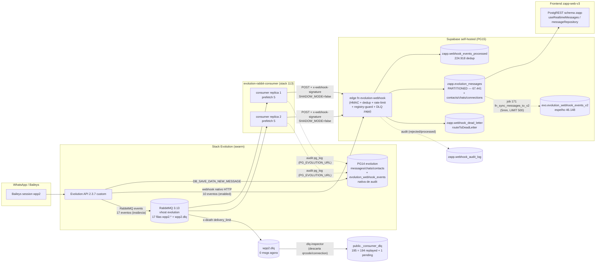

# DECISÃO DE INGESTÃO DE EVENTOS — Path Canônico + Plano de Migração

> **Auditoria:** AG-EX-06 (itens 11,12,14,15,16,17,18,19,20) · **Data:** 2026-08-06
> **Status:** ✅ DECIDIDO — evidências completas em [AG-EX-06-ingestao.md](./AG-EX-06-ingestao.md)
> **Escopo:** read-only em runtime; nenhuma mudança aplicada.

---

## 1. TL;DR — A Decisão

**O app NÃO fica cego se o webhook nativo parar de entregar `MESSAGES_*` — desde que o RabbitMQ + consumer bridge estejam vivos.** O consumer não é um "escritor paralelo em evo.*": ele re-POSTa o **mesmo payload** para a **mesma edge function** `evolution-webhook` (com HMAC), que é o único processador que escreve nas tabelas `zapp.*` que o frontend consome.

**Path canônico (dual-delivery assimétrico):**

| Path | Papel | Eventos | Estado |
|---|---|---|---|
| **Webhook nativo Evolution → edge fn** | **PRIMÁRIO para o app** (mensagens/contatos/chats/status) | 10 eventos (não inclui labels/groups/call/logout) | ✅ Ativo |
| **RabbitMQ → consumer (2 réplicas) → edge fn** | **RESILIÊNCIA + ARCHIVE** (audit nativo PG14) + eventos que o webhook não cobre | 17 filas `wpp2.*` | ✅ Ativo (shadow=false) |

**Recomendações-chave (detalhadas na seção 4):**

1. **NÃO migrar para consumer-only** (não desligar o webhook) — o consumer perde eventos em 4xx (429 e 404 de gateway são drop permanente no v6; ~3.576 perdas históricas) e não cobre `send.message` (SEND_MESSAGE só existe no webhook).
2. **Corrigir o consumer v6→v7**: 429 e 404-gateway (body não-JSON) devem virar `nack+requeue` com backoff; drop só para 4xx JSON da edge (400/401/403/422). *(fix já diagnosticado em rabbitmq-ops)*
3. **Alinhar drift QRCODE_UPDATED** (item 17): remover `QRCODE_UPDATED` do RabbitMQ da instância wpp2 — o env global já diz `RABBITMQ_EVENTS_QRCODE_UPDATED=false` e QR não precisa de fila (1.273 qrcode.updated já deduplicados + 8.955 na nativa = lixo).
4. **Adicionar `LOGOUT_INSTANCE` ao webhook nativo** — hoje só chega via fila; a edge fn já tem o handler.
5. **Reduzir `WEBHOOK_RETRY_MAX_ATTEMPTS` 10→4** e `MAX_DELAY_SECONDS` 300→60 (item 19).
6. **Manter reconcile (jobs 27/30/67/68) como guarda de consistência** — não aposentar enquanto existir dual-delivery (item 14).
7. **Drenar o 1 `pending` da DLQ espelho** (contacts.update 06/08 15:30) via replay idempotente; fila física já está em 0 (item 16).

---

## 2. Pergunta central respondida: de onde o app lê mensagens?

```
Baileys ──► Evolution API
                │
      ┌─────────┴──────────────┐
      ▼                        ▼
 Webhook nativo (HTTP)     RabbitMQ (17 filas wpp2.*)
      │                        │
      ▼                        ▼
 evolution-webhook       evolution-rabbit-consumer (2 réplicas)
 (edge fn — ÚNICO              │  (HMAC sha256, SHADOW_MODE=false)
  processador)                 ▼
      │                 POST p/ MESMA edge fn
      │                        │
      └────────────┬───────────┘
                   ▼
      zapp.webhook_events_processed (dedup event_id)
                   ▼
   handlers → zapp.evolution_messages (PARTITIONED TABLE)
              zapp.contacts, zapp.chats, zapp.whatsapp_connections,
              zapp.messages, zapp.whatsapp_groups, zapp.labels/tags...
                   ▼
        PostgREST (schema zapp) ◄── Frontend (createClient schema:'zapp')
```

**Evidências (detalhe em AG-EX-06):**
- `consumer.py` v6: `SUPABASE_URL = .../functions/v1/evolution-webhook` + `endpoint_path` = evento com `.`→`-` (path extra ignorado pelo edge-runtime; o body carrega o event). O consumer **não escreve em tabelas zapp./evo.** — só loga audit em `public.evolution_webhook_events` (PG14) via `PG_EVOLUTION_URL` (pg_log_ok=4.169 no uptime atual).
- Edge fn `evolution-webhook/index.ts`: `messages.upsert` → `handleIncomingMessage`/`handleOutgoingWhatsAppMessage` → `supabase.from('evolution_messages')` (schema zapp via `createZappAdminClient`); escreve também contacts/chats/whatsapp_connections/messages etc.
- Frontend: `src/integrations/supabase/client.ts` → `createClient<ExtendedDatabase, 'zapp'>(..., { schema: 'zapp' })`; mensageria lê `evolution_messages` (messageRepository, useRealtimeMessages, evolutionFetchers).
- `zapp.evolution_messages` é **tabela particionada** (relkind `p`); `evo.evolution_messages` é **view** (`v`) sobre ela (contagens idênticas 67.441); `evo.evolution_messages_wpp2` = tabela legado congelada (67.380).

**Resposta direta:** se o webhook parar de entregar `MESSAGES_*`, o consumer reentregaria via fila para a mesma edge fn → o app **continua recebendo** (atraso ~segundos). O cenário de cegueira real é: **webhook fora + (RabbitMQ fora OU consumer fora) simultaneamente**, ou perda 4xx do consumer sem cobertura do webhook. O risco residual é mitigado pelos itens 2-3 da seção 4.

---

## 3. Diagrama ponta a ponta (item 20)



---

## 4. Recomendações detalhadas

### 4.1 Path canônico (item 11) — DECISÃO: webhook primário + RabbitMQ como resiliência/archive

**Por que não consumer-only:**
- O consumer v6 faz **ack+drop** em qualquer 4xx — incluindo **429 rate_limit_exceeded (2.985 na nativa)** e **404 do gateway Traefik durante redeploys (625)** → perda permanente (a edge rola back a idempotência no 429 justamente para o evento ser reentregue, mas o consumer o descarta). O webhook nativo da Evolution NÃO dropa 429 (retenta por 10 tentativas com backoff).
- `send.message`/`SEND_MESSAGE` **não está** na lista de filas do consumer (17 filas, sem `wpp2.send.message`) → mensagens enviadas pelo app perderiam a confirmação `sent` (handler `handleSendMessage` → `zapp.messages`).
- O RabbitMQ vira SPOF para mensagens (broker + consumer + rede); o webhook é o mecanismo nativo mais simples e já provado.

**Por que não webhook-only:**
- RabbitMQ cobre eventos que o webhook não tem: `LABELS_EDIT/ASSOCIATION`, `GROUPS_*`, `GROUP_PARTICIPANTS_UPDATE`, `CALL`, `QRCODE_UPDATED`, `LOGOUT_INSTANCE`.
- A fila dá retenção/archive (nativa `public.evolution_webhook_events` em PG14) e a DLQ com replay idempotente — o webhook nativo sem retry bem-sucedido perde o evento (a edge fn devolve 200 até em handler_error justamente para evitar retry-storm, com DLQ interna).
- Custo de manter ambos é baixo: dedup por `event_id` (hash do body) + handlers idempotentes (upsert onConflict) absorvem o dual-delivery.

**Decisão:** manter **dual-delivery assimétrico** com o **webhook como primário** e **RabbitMQ como camada de resiliência + archive + eventos complementares**. Sem mudança de topologia; correções incrementais abaixo.

### 4.2 Itens por onda (wave 2 — execução)

| # | Ação | Item | Tipo | Rollback |
|---|---|---|---|---|
| W2-1 | Consumer v7: 429 e 4xx-gateway (body não-JSON) → `nack+requeue` com backoff (429: respeitar `Retry-After`); drop só p/ 4xx JSON da edge (400/401/403/422) | 11/16 | código+imagem GHCR (stack 113 pin por digest) | reverter digest para v6 (`113dc461...`) |
| W2-2 | Instância wpp2: remover `QRCODE_UPDATED` do RabbitMQ (alinhar com global `false`) | 17 | API Evolution (`/rabbitmq/setRabbitMQ`) | re-habilitar evento |
| W2-3 | Webhook nativo wpp2: adicionar `LOGOUT_INSTANCE` (handler já existe na edge) | 12 | API Evolution (`/webhook/setWebhook`) | remover evento |
| W2-4 | Env da Evolution: `WEBHOOK_RETRY_MAX_ATTEMPTS=10→4`, `WEBHOOK_RETRY_MAX_DELAY_SECONDS=300→60` | 19 | stack evolution (redeploy) | reverter env (arquivo stack versionado) |
| W2-5 | Replay do 1 `pending` da `_consumer_dlq` (contacts.update, id 29357) via script idempotente | 16 | psql + POST edge fn (HMAC) | idempotente por natureza |
| W2-6 | Manter reconcile 27/30/67/68 **sem mudança**; reavaliar aposentadoria só após W2-1 provar zero-drop em 30d | 14 | — | — |
| W2-7 | Persistir stats do consumer em tabela (`evo.evolution_rabbit_consumer_stats`) para KPI selecionável | 18 | migration + consumer v7 | sem impacto |

### 4.3 Item 12 — Webhook: eventos atuais e conjunto mínimo

**Atual (wpp2, enabled=true, webhookByEvents=false):** `MESSAGES_UPSERT, MESSAGES_UPDATE, MESSAGES_EDITED, MESSAGES_DELETE, SEND_MESSAGE, CONTACTS_UPSERT, CONTACTS_UPDATE, CHATS_UPSERT, CHATS_UPDATE, CONNECTION_UPDATE` (10).

**Conjunto mínimo recomendado (W2-3):** manter os 10 + `LOGOUT_INSTANCE` = 11. `LABELS_*`, `GROUPS_*`, `CALL` ficam **exclusivamente via RabbitMQ** (já cobertos pelo consumer). QRCODE_UPDATED fica fora dos dois (não precisa de push — QR é obtido por API; os 1.273 deduplicados + 8.955 na nativa são lixo).

### 4.4 Item 14 — Reconcile: papel e plano de aposentadoria

- **Papel:** os jobs 27/30/67/68 + `zapp.fn_reconcile_dispatch/apply` + `evo.evolution_reconcile_jobs` formam um **guarda de consistência do estado de conexão** (fetchInstances a cada 5min via pg_net + vault, aplica status/health em `zapp.whatsapp_connections` com debounce de 10min e prioridade por phone). Existe **por causa do dual-delivery**: connection.update pode ser perdido por qualquer um dos paths (drop 4xx, retry exausto), e o reconcile garante o estado final.
- **Números:** 1.312 jobs no total, 0 pending, 1.120 http_ok, 192 http_err (reaped/timeout — cobertos pelo reaper job 68), último dispatch 18:10.
- **Plano de aposentadoria (condicional):** só depois de W2-1 + 30d de `drop=0` e cobertura 100% de connection.update em ambos os paths, desligar job 27 (dispatch) e 30 (apply); manter 67 (cleanup) e 68 (reaper) por 7 dias para drenar a tabela; então DROP TABLE. **Não aposentar agora** — o reconcile custa ~2 chamadas/5min e é a rede de segurança do item 11.

### 4.5 Item 15 — Gap nativo × espelho: janelas explicadas

| Tabela | Linhas | Janela | Natureza |
|---|---|---|---|
| `public.evolution_webhook_events` (PG14, nativa) | 179.354 | 29/07 21:47 → 06/08 18:12 | **Audit do consumer** — janela curta (retenção/purga ~8 dias; NÃO é archive de 12m) |
| `evo.evolution_webhook_events_v2` (espelho) | 46.148 | 13/06 → 06/08 18:04 | **Mirror de mensagens** (39.263 com `sync_source=fn_sync_messages_to_v2` + 6.926 sem marca) — criado 13/06; janela = criação do espelho, não lag |
| `evo.evolution_messages_wpp2` (legado) | 67.380 | 01/02 → 06/08 18:09 | Tabela legado congelada (migração 2026-07-11); view em zapp |
| `zapp.webhook_events_processed` (dedup) | 224.918 | 02/08 04:30 → 06/08 18:09 | Dedup por event_id — começou 02/08 (introdução do dedup) |
| `zapp.evolution_messages` (ativa) | 67.441 | 01/02 → 06/08 18:13 | **Tabela do frontend** (particionada) |

**Conclusão:** NÃO é janela intencional de archive >12m, nem lag do job 171 (que roda a cada 5min com lag de minutos: espelho max 18:04 vs zapp max 18:13 = ~9min, dentro do ciclo + LIMIT 500). As janelas são as **datas de introdução de cada mecanismo**. A nativa é a única com retenção curta — confirmar política do `evolution-db-purge` (fora do escopo read-only de hoje).

### 4.6 Item 16 — DLQ 195: classificação e drenagem

- **Fila física `wpp2.dlq` = 0 msgs** (drenada em 05/08; dlq-inspector contínuo; policies `wpp2-dlq-policy` TTL 30d + `dlq-retention` priority 20 TTL 7d/max 10k).
- **Espelho `public._consumer_dlq` = 195 linhas: 194 `replayed` + 1 `pending`** (id 29357, `contacts.update`, wpp2, first_seen 06/08 15:30, attempts=1, sem erro).
- **Classificação:** NÃO é poison. Composição: contacts.update 61, messages.update 52, messages.upsert 38, chats.update 37, edited 4, group-participants 2, delete 1 — todos eventos reais reprocessáveis; os 194 replayed provam o caminho (idempotência da edge).
- **Critério de drenagem:** pending → replay via script (HMAC + rate 10/s) → `status='replayed'`; fila física >50 por 2 checagens → alerta (dlq-alert-guard F2-23); reacúmulo de qrcode.updated/connection.update → descartar como lixo (dlq-inspector já filtra).

### 4.7 Item 17 — Drift RabbitMQ instância × global

- **Instância wpp2** (`evo_rabbitmq_get`): `enabled=true`, 17 eventos **incluindo `QRCODE_UPDATED`**.
- **Global (env do container evolution)**: `RABBITMQ_ENABLED=true`, `RABBITMQ_GLOBAL_ENABLED=false`, `RABBITMQ_EVENTS_QRCODE_UPDATED=false` (só CONNECTION_UPDATE/MESSAGES_UPDATE/MESSAGES_UPSERT true).
- Com `RABBITMQ_GLOBAL_ENABLED=false` prevalece a config da **instância** → QRCODE_UPDATED vai para a fila (8.955 eventos na nativa, fila `wpp2.qrcode.updated` com 2 consumers).
- **Alinhamento (W2-2):** remover `QRCODE_UPDATED` da instância — QR não precisa de push (edge fn atualiza `whatsapp_connections.qr_code` apenas quando recebe; o fluxo real de QR é `POST /instance/connect` via API/MCP). Isso também reduz volume na nativa e na DLQ.

### 4.8 Item 18 — Consumer 2 réplicas: competição correta

- Serviço `evolution-rabbit-consumer_consumer` (stack 113): `replicas: 2`, imagem pinada por digest, `SHADOW_MODE=false`, `INSTANCE_PREFIX=wpp2`, entrypoint exporta secrets → env.
- Logs (2 réplicas, uptime ~3h): `[STATS] ok=4.163 shadow=0 retry=6 drop=0 err=0 filas=17/17 resub=0 pg_log_ok=4.169` (ambas com contadores individuais zerados no restart). API RabbitMQ: **todas as 17 filas com `cons=2`** = 34 consumers totais (round-robin do broker; prefetch 5 por canal).
- **Competição correta:** RabbitMQ entrega 1 msg a 1 consumer; redelivery pós-crash é absorvido pelo dedup da edge; F2-25 do guard só alerta com consumers=0 (ambas réplicas fora). Sem split-brain.

### 4.9 Item 19 — Retry do webhook: reduzir e adicionar circuit-breaker

- **Confirmado no env da evolution:** `WEBHOOK_RETRY_MAX_ATTEMPTS=10`, `WEBHOOK_RETRY_INITIAL_DELAY_SECONDS=5`, `WEBHOOK_RETRY_MAX_DELAY_SECONDS=300`, `WEBHOOK_RETRY_JITTER_FACTOR=0.2`, `WEBHOOK_RETRY_USE_EXPONENTIAL_BACKOFF=true`, `WEBHOOK_RETRY_NON_RETRYABLE_STATUS_CODES=400,401,403,404,422`, `WEBHOOK_REQUEST_TIMEOUT_MS=60000`, `WEBHOOK_EVENTS_ERRORS=true` → `evolution-webhook-proxy.adm01.workers.dev`.
- **Recomendação (W2-4):** `MAX_ATTEMPTS=4` (3-5), `MAX_DELAY_SECONDS=60`. Com exponencial 5s→60s o retry total fica ~2min — suficiente, pois o RabbitMQ é o backup e a edge devolve 200 em handler_error (evitando retry-storm). Manter 400/401/403/404/422 como non-retryable.
- **Circuit-breaker:** já existe no lado da edge (auto-pause `recordAuthFailureAndMaybePause` por instância, limiar 10/60s → pausa 15min; rate-limiter por event-type). O `WEBHOOK_EVENTS_ERRORS_WEBHOOK` dá telemetria. Recomenda-se manter; a redução de tentativas é o "breaker" do produtor.

---

## 5. Riscos e mitigações

| Risco | Prob. | Mitigação |
|---|---|---|
| Webhook + RabbitMQ fora simultâneo | Baixa | alertas F2-24/F2-25 (guard) + watchdog-baileys (last_event_age) + `zapp.webhook_audit_log` |
| Perda 4xx do consumer sem cobertura webhook | Média (hoje) | W2-1 (nack+requeue p/ 429/gateway) — elimina as 2 classes de perda permanente |
| Dedup cross-path depende de body byte-idêntico | Baixa | handlers idempotentes (upsert onConflict) — mesmo se hash diferir, sem duplicação nas tabelas |
| QRCODE_UPDATED na fila = lixo acumulando | Média | W2-2 + dlq-inspector já filtra |
| Reconcile desligado cedo demais | — | manter até 30d de zero-drop (W2-6) |

---

## 6. O que NÃO foi auditado / limitações

- Política de retenção/purga da tabela nativa `public.evolution_webhook_events` (PG14) — janela de 8 dias observada, causa exata (purge job vs recriação) não verificada (fora do escopo read-only de hoje).
- Conteúdo do `dist/main.js` da Evolution para confirmar semântica de `RABBITMQ_GLOBAL_ENABLED=false` × eventos por instância (inferido do comportamento observado: fila `wpp2.qrcode.updated` recebe eventos).
- `send.message` não coberto por fila — confirmar se há intenção de adicioná-lo ao RabbitMQ no futuro.
